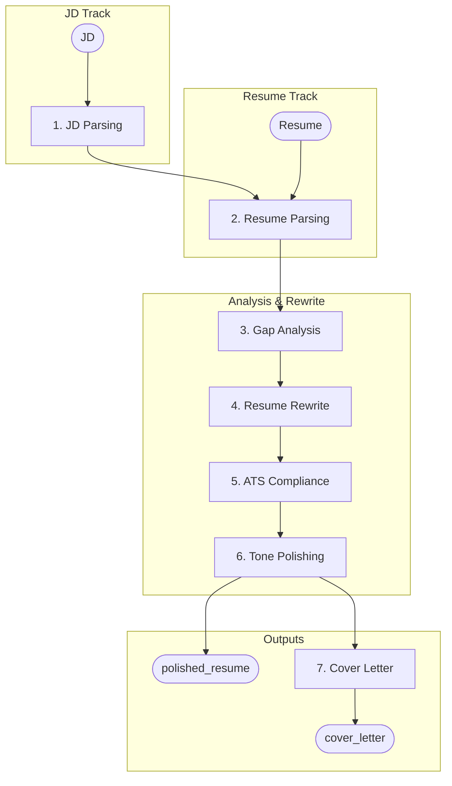

# resumes-v2

Multi-agent resume optimization pipeline. 7 sequential agents transform a job description + resume into an ATS-optimized resume and tailored cover letter. The pipeline is also exposed as a FastAPI web API (`app/`) with sync/async runs plus file listing and management.

> **Looking for the full guide?** Deep-dive installation, every CLI flag, common
> issues, and the complete API reference live in
> **[docs/README.md](docs/README.md)**. This page is the lean quickstart.

## Prerequisites

- Python 3.14+
- [uv](https://docs.astral.sh/uv/) installed
- [Ollama](https://ollama.com/) running on `localhost:11434`
- Model pulled: `ollama pull qwen2.5:7b-instruct`

## Quickstart — up and running in 10 minutes or less

**Total: ~10 minutes**, most of it waiting on `uv sync` and the first model
pull. Steps 1-2 set the environment; steps 3-5 are the fun part.

### 1. Prerequisites (0-5 min)

- **Python 3.14+**
- **[uv](https://docs.astral.sh/uv/)** installed
- **[Ollama](https://ollama.com/)** running on `localhost:11434` with the model
  pulled:

  ```bash
  ollama pull qwen2.5:7b-instruct
  ```

  Verify Ollama answers: `curl http://localhost:11434/api/tags` should list
  `qwen2.5:7b-instruct`.

### 2. Install dependencies (1 min)

```bash
uv sync
```

### 3. Run the sample pipeline (1-2 min)

```bash
uv run python pipeline.py
```

This runs all 7 agents (JD parsing -> resume parsing -> gap analysis ->
rewrite -> ATS -> polish -> cover letter) on the bundled sample files and
prints the polished resume and cover letter to stdout.

### 4. Run it on your own resume (1-2 min)

```bash
uv run python pipeline.py \
  --resume sample/resume/Peter-Letkeman-Resume.txt \
  --job-description sample/jobs/3Pillar.txt
```

Passing `--candidate-name "Peter Letkeman"` (optional `--company-name "3Pillar"`)
also renders `.txt`/`.md`/`.docx`/`.pdf` files into `output/` — when omitted,
the name parsed from the resume is used instead. `--jd` is
shorthand for `--job-description`. Add `--template classic|minimal|all` to
pick another resume layout — or `all` to render all three layouts in one run.
File mode requires both `--resume` and `--job-description`; the no-argument
form still runs the sample demo.

### 5. Try the web UI (2-3 min)

```bash
# terminal 1 — backend
uv run uvicorn app.main:app --reload

# terminal 2 — frontend
cd ui
npm install
npm run dev
```

Open the Vite URL shown in terminal 2, run a pipeline on the Run page, watch
the result tabs, then download the rendered files. FastAPI docs live at
`http://localhost:8000/docs`. See `ui/README.md` for the frontend guide.

### Done? Keep going

- Full command reference, model config, per-agent deep dives, troubleshooting,
  and API docs: **[docs/README.md](docs/README.md)**.
- The 7-agent flow and repo layout are summarised in the sections below.

## Usage

| What | Command |
| --- | --- |
| Install/sync deps | `uv sync` |
| Full 7-agent pipeline | `uv run python pipeline.py` |
| Pipeline with your files | `uv run python pipeline.py --resume <file> --job-description <file>` |
| Single-agent demo | `uv run python basic.py` |
| Test JD Parsing Agent | `uv run python wip_testing/test_job_description.py` |
| Test Resume Parsing Agent | `uv run python wip_testing/test_resume_parsing.py` |
| Test Gap Analysis Agent | `uv run python wip_testing/test_gap_analysis.py` |
| Test Resume Rewrite Agent | `uv run python wip_testing/test_resume_rewrite.py` |
| Test ATS Compliance Agent | `uv run python wip_testing/test_ats_compliance.py` |
| Test Tone Polishing Agent | `uv run python wip_testing/test_tone_polishing.py` |
| Test Cover Letter Agent | `uv run python wip_testing/test_cover_letter.py` |
| Regex parsing test (no LLM) | `uv run python wip_testing/test_parsing.py` |
| Live E2E pipeline test | `uv run python test_real_files.py` (requires Ollama) |
| Check which model each agent uses | `uv run python -c "from config.agents import get_model_summary; [print(f'{a[\"agent\"]}: {a[\"provider\"]}/{a[\"model\"]}') for a in get_model_summary()]"` |
| Lint | `uv run ruff check .` |
| Lint (auto-fix) | `uv run ruff check --fix .` |
| Format check | `uv run ruff format --check .` |
| Format (auto-fix) | `uv run ruff format .` |
| Typecheck | `uv run pyright` (no `.` — passes `.` recurses into `.venv/`) |
| Test | `uv run pytest` |
| Test (verbose) | `uv run pytest -v` |
| Test (single file) | `uv run pytest tests/test_format_detector.py` |
| Test with coverage | `uv run pytest --cov` |
| Coverage HTML report | `uv run pytest --cov --cov-report=html` |
| Run web API | `uv run uvicorn app.main:app --reload` |

See `docs/TESTING.md` for detailed testing instructions (individual agents, OpenAI provider, model registry).

## Web API

The pipeline is also exposed as a FastAPI application (`app/main.py`). Start it with:

```bash
uv run uvicorn app.main:app --reload
```

OpenAPI docs are at `http://localhost:8000/docs`.

### Routes

| Method | Route | Purpose |
| --- | --- | --- |
| `GET` | `/health` | Liveness check |
| `GET` | `/api/models` | List configured models per agent |
| `POST` | `/api/pipeline` | Run the full 7-agent pipeline (sync) |
| `POST` | `/api/pipeline/async` | Launch a background pipeline run |
| `GET` | `/api/tasks/{task_id}` | Poll a background task's status/result |
| `GET` | `/api/outputs/{filename}` | Download a rendered output file |
| `GET` | `/api/files/generated` | List generated files (`output/`) — filter + paged |
| `GET` | `/api/files/uploaded` | List uploaded files (`uploads/`) — filter + paged |
| `DELETE` | `/api/files` | Delete selected files (from either listing) |

Pipeline inputs are multipart fields: `job_description` / `resume` (pasted text) or `job_file` / `resume_file` (uploads), plus optional `candidate_name` / `company_name`. Exactly one of text-or-file is required per input; text wins when both are supplied. Uploaded files are persisted to `uploads/` and rendered outputs to `output/` (both git-ignored).

### Testing the API with REST Client

To call the API from VS Code, install the **REST Client** extension:
[rest-client-free](https://marketplace.visualstudio.com/items?itemName=SergeyEgorov.rest-client-free)

1. Install the extension from the Marketplace link above.
2. Create a request file and open it in VS Code. Note: this extension stores requests in a **`.fetch-client`** directory/file (not the `.http` extension).
3. Each block is a request; press the **Send Request** link above each one to run it.

Example request (start the server first, then send this):

```http
@base = http://localhost:8000

### Health check
GET {{base}}/health

### List configured models
GET {{base}}/api/models
```

Request files are plain text and git-friendly, so keep them in the repo and modify them freely.

## Pipeline flow



## Architecture

```plaintext
pipeline.py              # AgentRunner, PipelineAgent, run_resume_pipeline()
basic.py                 # Single-agent demo
logging_config.py        # Centralized logging (dictConfig, LOG_LEVEL env var)
config/agents.py         # Env-var-based agent-to-model configuration
client/
  errors.py            # LLMError hierarchy (LLMConnectionError, LLMResponseError, LLMTimeoutError)
  model_client.py      # ABC for LLM clients (chat() requires response_format; optional json_schema)
  ollama_client.py     # Ollama implementation (configurable timeout, default 300s; format="json" always)
  open_ai_client.py    # OpenAI implementation (response_format json_object / json_schema envelope)
  model_registry.py    # Per-agent model assignment (ModelClientRegistry)
  json_utils.py        # Shared parse_json_response + model_to_json_schema helpers
  format_detector.py   # Regex parser with LLM fallback (connected)
  formatter.py         # Output formatting helpers (format_resume_markdown/plain, format_cover_letter)
  models.py            # All Pydantic models
  agents/
    jd_parsing.py        # JD Parsing Agent (Agent 1) - dedicated class
    resume_parsing.py    # Resume Parsing Agent (Agent 2) - dedicated class
    gap_analysis.py      # Gap Analysis Agent (Agent 3) - dedicated class
    resume_rewrite.py    # Resume Rewrite Agent (Agent 4) - dedicated class
    ats_compliance.py    # ATS Compliance Agent (Agent 5) - dedicated class
    tone_polishing.py    # Tone Polishing Agent (Agent 6) - dedicated class
    cover_letter.py      # Cover Letter Agent (Agent 7) - dedicated class
  skills/                # Shared SkillNormalizer (canonical skill taxonomy)
    normalizer.py        # SkillNormalizer: canonical normalization/localization
    taxonomy.json        # Canonical skill taxonomy data
  templates/             # Jinja2 templates (modern/classic/minimal/cover_letter)
    renderer.py          # ResumeRenderer: plaintext/markdown/cover-letter/docx/pdf + render_all()
tests/
  test_format_detector.py          # FormatDetector regex parsing tests (46 tests)
  test_jd_parsing.py               # JD Parsing company_name extraction/sync tests (19 tests)
  test_resume_rewrite_validation.py # Resume Rewrite post-validation tests (63 tests)
  test_cover_letter_validation.py  # Cover Letter post-validation tests (109 tests)
  test_model_clients.py            # response_format + Structured Outputs plumbing tests (11 tests)
  test_json_utils.py               # shared parser + load_json_safe + JSON Schema helper tests (23 tests)
  test_formatter.py                # format_* helpers (41 tests)
  test_renderer.py                 # ResumeRenderer plaintext/markdown/docx/pdf/render_all incl. multi-template + cover-letter signature (66 tests)
  test_skill_normalizer.py         # SkillNormalizer canonical taxonomy tests (15 tests)
  test_agent_jd_parsing.py         # Agent 1 contract tests (7 tests)
  test_agent_resume_parsing.py     # Agent 2 contract tests (9 tests)
  test_agent_gap_analysis.py       # Agent 3 contract tests (7 tests)
  test_agent_resume_rewrite.py     # Agent 4 contract tests (8 tests)
  test_agent_ats_compliance.py     # Agent 5 contract tests (8 tests)
  test_agent_tone_polishing.py     # Agent 6 contract tests (6 tests)
  test_agent_cover_letter.py       # Agent 7 contract tests (10 tests)
  test_pipeline.py                 # AgentRunner / run_resume_pipeline orchestration + template passthrough (22 tests)
  test_model_store.py              # SQLite agent model override store (11 tests)
  test_web_health.py               # Web health + models routes (2 tests)
  test_web_models_edit.py          # Web model/provider edit + reset routes (14 tests)
  test_web_pipeline.py             # Web sync + async pipeline routes + template validation (13 tests)
  test_web_tasks.py                # TaskRegistry + tasks routes (9 tests)
  test_web_outputs.py              # Output file serving (3 tests)
  test_web_files.py                # File listing + deletion (11 tests)
  test_web_upload.py               # Text extraction unit (9 tests)
  test_web_spa.py                  # Built-SPA mount + catch-all fallback (8 tests)
test_real_files.py                 # Live 7-agent E2E test (requires Ollama)
wip_testing/
  test_job_description.py  # JD Parsing Agent test
  test_resume_parsing.py   # Resume Parsing Agent test
  test_gap_analysis.py     # Gap Analysis Agent test
  test_resume_rewrite.py   # Resume Rewrite Agent test
  test_ats_compliance.py   # ATS Compliance Agent test
  test_tone_polishing.py   # Tone Polishing Agent test
  test_cover_letter.py     # Cover Letter Agent test
  test_parsing.py          # Regex + LLM parsing demo
app/                       # FastAPI web API layer
  main.py                  # App + lifespan + all routes
  schemas.py               # Pydantic request/response models
  upload.py                # .txt/.docx/.pdf text extraction
  tasks.py                 # In-memory background task registry
  files.py                 # File listing/filter/paging + delete helpers
```

## Configuration

- **Default model:** `qwen2.5:7b-instruct` on Ollama
- **Per-agent overrides** via env vars: `COVER_LETTER_AGENT_MODEL=gpt-4o`, `COVER_LETTER_AGENT_PROVIDER=openai`
- **Global override:** `MODEL_PROVIDER` and `MODEL_NAME`
- **Logging:** `LOG_LEVEL` env var (default `INFO`). Set to `DEBUG` for verbose LLM traffic.

## Project structure

- `sample/jobs/` - Sample job descriptions for testing
- `sample/resume/` - Sample resume for testing
- `test_real_files.py` - Live 7-agent end-to-end test (requires Ollama; `RUN_LIVE_PIPELINE` guard)
- `client/skills/` - Shared `SkillNormalizer` + canonical skill taxonomy
- `client/templates/` - Jinja2 templates (modern, classic, minimal, cover letter) + `renderer.py` (`ResumeRenderer`)
- `docs/models.md` - Quick reference for all Pydantic models
- `docs/TESTING.md` - Detailed testing guide (including coverage)
- `docs/logging-info.md` - Logging implementation plan and status
- `docs/skill-taxonomy.md` - Skill taxonomy (`taxonomy.json`) reference and usage
- `docs/architecture.md` - System overview + Mermaid data-flow diagram
- `docs/agents.md` - Agent-by-agent reference (prompts, input/output schemas, fallbacks)
- `docs/usage.md` - Quickstart, model configuration, adding custom agents
- `docs/api.md` - API reference (`ModelClient`, agents, `ResumeRenderer`, formatters)
- `scratch/resume-done.md` - Completed work archive (all phases 1-10 complete)
- `scratch/resume-todo.md` - Completed-work log (all done; pointer to `resume-done.md`)
- `scratch/resume-web-todo.md` - Web API (FastAPI) work log
- `scratch/web-files-todo.md` - File-management endpoint work log

## Test coverage

Coverage is provided by **pytest-cov** (installed as a dev dependency). The
configuration lives in `pyproject.toml` under `[tool.coverage.run]` /
`[tool.coverage.report]` and measures the `app/`, `client/`, `config/`
packages plus `pipeline.py` (tests and `wip_testing/` are excluded). Branch
coverage is on.

```bash
# Terminal summary
uv run pytest --cov

# HTML report (opens like a webpage, browse by file/line)
uv run pytest --cov --cov-report=html

# Per-file HTML report for specific modules (e.g. the seven agents)
uv run pytest --cov=client.agents --cov-report=html

# XML report (CI / other tooling)
uv run pytest --cov --cov-report=xml
```

Artifacts are written to `.coverage` (data) and `htmlcov/` (HTML). Both are
git-ignored. The verbose `--cov-report=term-missing` flag shows the line
numbers of uncovered statements.
