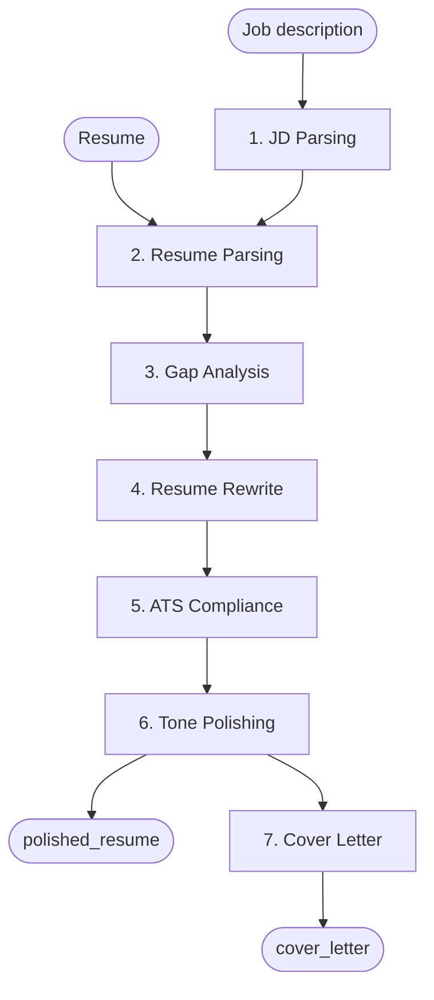

# README — Detailed Documentation

- [README — Detailed Documentation](#readme--detailed-documentation)
  - [Table of contents](#table-of-contents)
  - [1. Overview](#1-overview)
  - [2. Getting started, in detail](#2-getting-started-in-detail)
    - [2.1 Prerequisites](#21-prerequisites)
    - [2.2 Install dependencies](#22-install-dependencies)
    - [2.3 Verify the install (no pipeline needed)](#23-verify-the-install-no-pipeline-needed)
    - [2.4 Run the pipeline](#24-run-the-pipeline)
    - [2.5 Run the web API and the React UI](#25-run-the-web-api-and-the-react-ui)
    - [2.6 Run the tests](#26-run-the-tests)
  - [3. Command-line reference](#3-command-line-reference)
    - [3.1 `pipeline.py` — all switches](#31-pipelinepy--all-switches)
    - [3.2 Other CLI commands](#32-other-cli-commands)
  - [4. Model configuration](#4-model-configuration)
  - [5. Web API + frontend](#5-web-api--frontend)
    - [5.1 Running it](#51-running-it)
    - [5.2 Routes](#52-routes)
    - [5.3 Inputs](#53-inputs)
    - [5.4 Example (VS Code REST Client)](#54-example-vs-code-rest-client)
  - [6. Output rendering](#6-output-rendering)
  - [7. Common issues and fixes](#7-common-issues-and-fixes)
    - [LLM / model](#llm--model)
    - [Toolchain](#toolchain)
    - [Rendering / web](#rendering--web)
    - [Tests](#tests)
  - [Documentation index (alpha)](#documentation-index-alpha)

This is the in-depth documentation for the **resumes-v2** repo: a multi-agent
resume optimization pipeline. Seven sequential agents transform a job
description + resume into an ATS-optimized resume and a tailored cover letter,
optionally rendered to `.txt` / `.md` / `.docx` / `.pdf`. It runs on a local
Ollama server (or OpenAI) and is also exposed as a FastAPI web API (`app/`)
with a React frontend (`ui/`).

The **root `README.md` is the quickstart** (up and running in 10 minutes).
This file is the detailed companion: full installation, every command-line
switch with examples, and common issues with fixes. Appendices deep-dive each
subsystem.

> Use `docs/README.md` as the entry point: it links every guide below. The
> guides are also linked to each other alphabetically (see
> [Documentation index](#documentation-index-alpha)).

## Table of contents

1. [Overview](#1-overview)
2. [Getting started, in detail](#2-getting-started-in-detail)
3. [Command-line reference](#3-command-line-reference)
4. [Model configuration](#4-model-configuration)
5. [Web API + frontend](#5-web-api--frontend)
6. [Output rendering](#6-output-rendering)
7. [Common issues and fixes](#7-common-issues-and-fixes)
8. [Documentation index (alpha)](#documentation-index-alpha)

---

## 1. Overview



| Stage | Agent | Output key (dict key) | Consumed by |
|---|---|---|---|
| 1 | `jd_parsing_agent` | `parsed_job_description` | gap analysis, cover letter |
| 2 | `resume_parsing_agent` | `parsed_resume` | gap analysis, rewrite, cover letter, rendering |
| 3 | `gap_analysis_agent` | `tailoring_strategy` | rewrite, cover letter |
| 4 | `resume_rewrite_agent` | `rewritten_resume` | ATS compliance |
| 5 | `ats_compliance_agent` | `ats_optimized_resume` | tone polishing |
| 6 | `tone_polishing_agent` | `polished_resume` | final result |
| 7 | `cover_letter_agent` | `cover_letter` | final result |

The returned dict from `run_resume_pipeline()` always has those 7 keys; when a
candidate name is available (explicit or parsed from the resume), an eighth key
`output_files` maps format names to written `Path`s (see
[Output rendering](#6-output-rendering)).

Every agent runs on either **Ollama** (local, default) or **OpenAI**. Each
LLM call uses provider-native JSON mode (`response_format="json"`) plus an
optional strict JSON Schema (`json_schema=model_to_json_schema(<Model>)`) for
Structured Outputs. Agents fall back deterministically when the LLM fails (see
[Common issues](#7-common-issues-and-fixes) and `agents.md`).

References: `architecture.md` (system + data flow), `agents.md`
(per-agent prompts/schemas/fallbacks), `models.md` (Pydantic models).

---

## 2. Getting started, in detail

### 2.1 Prerequisites

- **Python 3.14+** — hard requirement (see `pyproject.toml`). `uv` will
  download and manage it for you if you do not have 3.14 installed.
- **[uv](https://docs.astral.sh/uv/)** — the package/project manager.
- **Ollama** running on `localhost:11434` with the default model:

  ```bash
  ollama pull qwen2.5:7b-instruct
  ```

  Verify the server responds and the model is present:

  ```bash
  curl http://localhost:11434/api/tags        # should list qwen2.5:7b-instruct
  ```

  No infrastructure is needed beyond the local server. To use OpenAI instead,
  set `MODEL_PROVIDER=openai` and `OPENAI_API_KEY` (section 4).

### 2.2 Install dependencies

```bash
uv sync
```

This creates the virtualenv and installs `ollama`, `openai`, `pydantic`,
`fastapi`, `python-docx`, `reportlab`, `jinja2`, dev tools (`ruff`,
`pyright`, `pytest`, `pytest-cov`, `pytest-asyncio`), and the `ui/` runtime is
installed separately with `npm install` (section 2.5).

### 2.3 Verify the install (no pipeline needed)

```bash
uv run python basic.py                       # one-shot LLM chat in JSON mode
uv run python -c "from config.agents import get_model_summary as g; [print(f"{a['agent']}: {a['provider']}/{a['model']}") for a in g()]"
```

The second prints which model each of the 7 agents uses. With no overrides it
should list 7 rows of `ollama/qwen2.5:7b-instruct`.

### 2.4 Run the pipeline

**Sample (no arguments):**

```bash
uv run python pipeline.py
```

Runs the full 7-agent chain on placeholder text and prints the polished resume
and cover letter to stdout.

**Your own files:**

```bash
uv run python pipeline.py \
  --resume sample/resume/Peter-Letkeman-Resume.txt \
  --job-description sample/jobs/3Pillar.txt \
  --candidate-name "Peter Letkeman" \
  --company-name "3Pillar"
```

`--candidate-name` (or the name parsed from the resume) enables rendering the
output files into `output/` (see section 6). Full flag reference in section 3.1.

### 2.5 Run the web API and the React UI

Two terminals from the repo root:

```bash
# terminal 1 — FastAPI backend
uv run uvicorn app.main:app --reload

# terminal 2 — React frontend
cd ui
npm install
npm run dev
```

Open the Vite URL printed by terminal 2 (the dev server proxies `/api` and
`/health` to `localhost:8000`). FastAPI's interactive docs are at
`http://localhost:8000/docs`. The backend serves the built SPA from
`ui/dist` automatically when `ui/dist/index.html` exists (production mode) —
build it once with `npm run build` inside `ui/`.

### 2.6 Run the tests

```bash
uv run pytest                # deterministic unit suite: 575 tests, no LLM needed
uv run pytest -v             # verbose
uv run pytest --cov          # coverage summary
uv run pytest tests/test_renderer.py   # a single file
```

Frontend (from `ui/`):

```bash
npm test -- --run            # 61 tests, Vitest
npm run lint                 # oxlint
npx tsc -b                   # type-check + build
```

Live end-to-end (requires Ollama):

```bash
uv run python test_real_files.py
# or, via pytest with the guard:
$env:RUN_LIVE_PIPELINE="1"; uv run pytest test_real_files.py
```

See `TESTING.md` for the full manual testing guide and coverage how-to.

---

## 3. Command-line reference

### 3.1 `pipeline.py` — all switches

`uv run python pipeline.py [-h] [--resume PATH] [--job-description PATH]
[--candidate-name NAME] [--company-name NAME] [--template {modern,classic,minimal,all}]`

| Flag | Alias | Default | Meaning |
|---|---|---|---|
| `--resume PATH` | — | (none) | Path to the plain-text resume file. |
| `--job-description PATH` | `--jd` | (none) | Path to the plain-text job description file. |
| `--candidate-name NAME` | — | `""` | Candidate name used in rendered outputs/headers. **Enables file rendering** (falls back to the name parsed from the resume when omitted). |
| `--company-name NAME` | — | `""` | Target company name used in rendered output filenames. |
| `--template TEMPLATE` | — | `modern` | Resume layout: `modern`, `classic`, `minimal`, or `all` (renders all three layouts in one run; files are namespaced `resume-{template}.*`). |
| `-h` / `--help` | — | — | Print usage and exit. |

**Two modes:**

1. **Sample mode** — no `--resume` and no `--job-description`: runs
   `sample_run()` on placeholder text. Nothing is rendered unless the sample
   passes a candidate name.
2. **File mode** — both `--resume` and `--job-description` required. Missing
   either (or a path that does not exist) is a usage error.

**Exit codes:** `0` on success; `2` on argument/path errors (argparse
`parser.error`). The polished resume and cover letter are printed to stdout;
with `--candidate-name` the rendered files are listed too.

**Examples:**

```bash
# Sample demo
uv run python pipeline.py

# Full run with rendering, long flags
uv run python pipeline.py \
  --resume /path/to/resume.txt \
  --job-description /path/to/jd.txt \
  --candidate-name "Jane Doe" \
  --company-name "Acme"

# Same, using the --jd shorthand and no rendering
uv run python pipeline.py --resume resume.txt --jd jd.txt

# Render the classic layout only
uv run python pipeline.py --resume resume.txt --jd jd.txt --template classic

# Render all three layouts in one run
uv run python pipeline.py --resume resume.txt --jd jd.txt --template all
```

### 3.2 Other CLI commands

| Command | What it does |
|---|---|
| `uv run python basic.py` | Single-agent smoke test (JSON mode chat). |
| `uv run python test_real_files.py` | Live 7-agent E2E: pipeline on the sample files + PASS/FAIL summary (needs Ollama). |
| `uv run python wip_testing/test_job_description.py` | JD Parsing Agent demo (chains agent 1). |
| `uv run python wip_testing/test_resume_parsing.py` | Resume Parsing Agent demo (chains 1-2). |
| `uv run python wip_testing/test_gap_analysis.py` | Gap Analysis Agent demo (chains 1-3). |
| `uv run python wip_testing/test_resume_rewrite.py` | Resume Rewrite Agent demo (chains 1-4). |
| `uv run python wip_testing/test_ats_compliance.py` | ATS Compliance Agent demo (chains 1-5). |
| `uv run python wip_testing/test_tone_polishing.py` | Tone Polishing Agent demo (chains 1-6). |
| `uv run python wip_testing/test_cover_letter.py` | Cover Letter Agent demo (chains 1-7). |
| `uv run python wip_testing/test_parsing.py` | Regex + LLM `FormatDetector` parsing demo. |
| `uv run pytest` | Unit suite (`tests/`, 575 tests, no LLM). |
| `uv run pytest -v` / `--cov` / `--cov-report=html` | Verbose / coverage / HTML coverage report. |
| `uv run pytest tests/test_<name>.py` | Run one test file. |
| `uv run ruff check .` | Lint. |
| `uv run ruff check --fix .` | Lint + autofix. |
| `uv run ruff format .` | Format. |
| `uv run pyright` | Type-check (**no path argument** — see common issues). |
| `uv run uvicorn app.main:app --reload` | Run the web API. |
| `uv run python -c "from config.agents import get_model_summary ..."` | Print each agent's provider/model. |

Environment variables (see section 4): `MODEL_PROVIDER`, `MODEL_NAME`,
`OPENAI_API_KEY`, `<AGENT>_PROVIDER`, `<AGENT>_MODEL`, `LOG_LEVEL`,
`RUN_LIVE_PIPELINE`.

---

## 4. Model configuration

Configuration is 100% environment-variable driven (`config/agents.py`); there
is no config file.

| Variable | Default | Meaning |
|---|---|---|
| `MODEL_PROVIDER` | `ollama` | `ollama` or `openai` for the default client. |
| `MODEL_NAME` | `qwen2.5:7b-instruct` | Model for the default client. |
| `OPENAI_API_KEY` | `""` | Required when any resolved provider is `openai`. |
| `<AGENT>_PROVIDER` | — | Per-agent provider override. |
| `<AGENT>_MODEL` | — | Per-agent model override. |
| `LOG_LEVEL` | `INFO` | Root logger level; `DEBUG` for verbose LLM traffic. |
| `RUN_LIVE_PIPELINE` | — | `1`/`true` enables the live E2E under pytest. |

The per-agent prefix is the **uppercased snake_case agent name**: e.g.
`COVER_LETTER_AGENT_PROVIDER=openai`, `COVER_LETTER_AGENT_MODEL=gpt-4o`,
`RESUME_REWRITE_AGENT_MODEL=qwen2.5:14b`. Setting one of the pair inherits the
global default for the other. An agent with an override gets its own registry
client; all others share the default.

**How it resolves** (`get_agent_config()` → `ModelClientRegistry.from_config()`
→ `AgentRunner`):

1. A `default` client is always built from `MODEL_PROVIDER` + `MODEL_NAME`
   (+ `api_key` when OpenAI).
2. For each of the 7 agents, if either `<AGENT>_PROVIDER` or `<AGENT>_MODEL`
   is set, a per-agent client is created and the agent is assigned to it.
3. The runner instantiates each agent with `registry.get_client_for_agent(name)`
   on first use.

**OpenAI example (Windows PowerShell / POSIX):**

```powershell
$env:MODEL_PROVIDER="openai"; $env:MODEL_NAME="gpt-4o"; $env:OPENAI_API_KEY="sk-..."
uv run python pipeline.py
```

```bash
MODEL_PROVIDER=openai MODEL_NAME=gpt-4o OPENAI_API_KEY=sk-... uv run python pipeline.py
```

Verify assignments: `uv run python -c "from config.agents import get_model_summary as g; [print(f"{a['agent']}: {a['provider']}/{a['model']}") for a in g()]"`

For adding a *custom* agent (class contract, registry wiring,
`DEFAULT_AGENT_CLASSES`), see `usage.md` §3.

---

## 5. Web API + frontend

### 5.1 Running it

```bash
uv run uvicorn app.main:app --reload     # http://localhost:8000, docs at /docs
```

Frontend (dev): `cd ui && npm install && npm run dev` — Vite proxies `/api`
and `/health` to `localhost:8000`. Production: `npm run build` in `ui/` then
the FastAPI app serves `ui/dist` and falls back to `index.html` for non-API
routes when `ui/dist/index.html` exists.

### 5.2 Routes

| Method | Route | Purpose |
|---|---|---|
| `GET` | `/health` | Liveness check. |
| `GET` | `/api/models` | List configured model per agent. |
| `PATCH` | `/api/models/{agent}` | Edit an agent's provider and/or model (SQLite-persisted). |
| `DELETE` | `/api/models/{agent}` | Reset an agent's provider/model to defaults. |
| `POST` | `/api/pipeline` | Run the full pipeline synchronously (multipart). |
| `POST` | `/api/pipeline/async` | Launch a background run; returns `task_id`. |
| `GET` | `/api/tasks/{task_id}` | Poll a task's status/result. |
| `GET` | `/api/outputs/{filename}` | Download a rendered output file. |
| `GET` | `/api/files/generated` | List `output/` files (filter/paged). |
| `GET` | `/api/files/uploaded` | List `uploads/` files (filter/paged). |
| `DELETE` | `/api/files` | Delete selected files from either listing. |

### 5.3 Inputs

Multipart fields: `job_description` / `resume` (pasted text) or
`job_file` / `resume_file` (uploads), plus optional `candidate_name` /
`company_name` and `resume_template` (`modern`/`classic`/`minimal`, default
`modern`, or `all` to render every layout). Exactly one of text-or-file is
required per input; **text wins when both are supplied** (`_read_text_input`
in `app/main.py`). An unknown `resume_template` returns 400. Uploaded files
are persisted to `uploads/`, rendered outputs to `output/` (both git-ignored).

### 5.4 Example (VS Code REST Client)

```http
@base = http://localhost:8000

### Health check
GET {{base}}/health

### List configured models
GET {{base}}/api/models

### Edit an agent's model + provider (NULL/omitted = inherit defaults)
PATCH {{base}}/api/models/cover_letter_agent
Content-Type: application/json

{
  "provider": "openai",
  "model": "gpt-4o"
}

### Reset an agent to defaults
DELETE {{base}}/api/models/cover_letter_agent

### Launch an async pipeline run
POST {{base}}/api/pipeline/async
Content-Type: multipart/form-data; boundary=----x

------x
Content-Disposition: form-data; name="job_file"; filename="jd.txt"
Content-Type: text/plain

< sample/jobs/3Pillar.txt
------x
Content-Disposition: form-data; name="resume_file"; filename="resume.txt"
Content-Type: text/plain

< sample/resume/Peter-Letkeman-Resume.txt
------x
Content-Disposition: form-data; name="candidate_name"

Peter Letkeman
------x--

### Poll the task (replace {id} with the returned task id)
GET {{base}}/api/tasks/{id}
```

`app/main.py` mirrors this contract; unit tests live in `tests/test_web_*.py`.

---

## 6. Output rendering

Rendering is done by `ResumeRenderer` (`client/templates/renderer.py`) using
Jinja2 templates (`client/templates/`: `modern`, `classic`, `minimal`,
`cover_letter`) — or the simpler `client/formatter.py` string helpers.
`render_all()` writes these files when a candidate name is available — the
explicit `candidate_name` argument, or the name parsed from the resume when it
is omitted:

| `output_files` key | Extension |
|---|---|
| `resume_plaintext` | `.txt` |
| `resume_markdown` | `.md` |
| `resume_docx` | `.docx` |
| `resume_pdf` | `.pdf` |
| `cover_letter_plaintext` | `.txt` (only when the letter is non-empty) |
| `cover_letter_markdown` | `.md` (only when the letter is non-empty) |
| `cover_letter_docx` | `.docx` (only when the letter is non-empty) |
| `cover_letter_pdf` | `.pdf` (only when the letter is non-empty) |

By default a single layout is rendered (`resume_template`, default `modern`).
When `resume_templates` is passed (a key or list of keys — e.g. the web API's
`resume_template=all` or the CLI's `--template all`), each layout renders its
own namespaced keys `resume_{template}_plaintext` … `resume_{template}_pdf`
(e.g. `resume_classic_pdf`) and the filenames embed the template
(`resume-classic.pdf`) so the layouts never overwrite each other. The cover
letter keys are shared and unchanged.

Filenames follow `{YYYYMMDD}_{candidate}_{company6}_{document_type}.{ext}`
with every segment slugified (e.g. `cover_letter` → `cover-letter`), so the
actual file looks like
`20260812_peter-letkeman_3pilla_cover-letter.txt`. The date carries no time
(a same-day rerun overwrites the previous files) and the company segment is
the first six characters of the company name, taken from the explicit
`company_name` or the parsed job description. With no candidate name
available (explicit or parsed from the resume), rendering is skipped and
`output_files` is `{}`.

---

## 7. Common issues and fixes

### LLM / model

| Symptom | Cause | Fix |
|---|---|---|
| Agents produce fallback output (or degrade), pipeline logs connection errors | Ollama not running on `localhost:11434` | Start Ollama (`ollama serve` or the tray app); verify `curl http://localhost:11434/api/tags`. |
| `LLMConnectionError` / `LLMTimeoutError` | Ollama unreachable / first-load timeout (default 300 s) | Confirm the server is up and the model is pulled; retry. |
| `ollama pull` needed | Model absent locally | `ollama pull qwen2.5:7b-instruct` (or the `MODEL_NAME` you set). |
| OpenAI errors / `api_key` missing | `OPENAI_API_KEY` not set | Set `$env:OPENAI_API_KEY=...` before running. |
| Gap analysis logs "deterministic cross-check differs from LLM" | LLM and canonical skill matcher disagree | Advisory only — result still contains the LLM strategy; no action needed. |
| Cover letter logs "outside 450-600 spec (accepting)" | Length outside the spec but within 200-800 words | Advisory; only <200 or >800 words are rejected. |

### Toolchain

| Symptom | Cause | Fix |
|---|---|---|
| `uv run pyright .` spews thousands of third-party errors | passing `.` recurses into `.venv/` | Run `uv run pyright` with **no path argument**. |
| ruff reformats `except (A, B):` to `except A, B:` | ruff 0.16 + `target-version = "py314"` canonicalizes PEP 758 comma form | Expected; the comma form is the repo convention. |
| `pip install`-style errors / `uv` wants Python 3.14 | Python < 3.14 without `uv` managing it | Let `uv sync` fetch 3.14 (`requires-python = ">=3.14"`); or install 3.14. |
| Git warns "LF will be replaced by CRLF" when committing | Windows line endings | Harmless `core.autocrlf` behavior; no action needed. |
| `pytest` skips `test_real_files.py` | `RUN_LIVE_PIPELINE` guard not set (or Ollama down) | `$env:RUN_LIVE_PIPELINE="1"; uv run pytest test_real_files.py` — or run `uv run python test_real_files.py`. |

### Rendering / web

| Symptom | Cause | Fix |
|---|---|---|
| `output_files` is empty / no files rendered | No candidate name available — neither `--candidate-name` (or API `candidate_name`) nor a name parsed from the resume | Pass `--candidate-name "Name"`, or ensure the resume's top line contains the candidate name (used as the rendering fallback). |
| Output filenames use `cover-letter` (hyphen) not `cover_letter` | `ResumeRenderer.build_output_path` slugifies every segment | Expected naming; adjust any test/globs to match `cover[-_]letter`. |
| API returns 400 "one of text-or-file" | Both absent or text+file provided both absent | Supply pasted text **or** one file per input; text wins when both present. |
| `RecursionError` / event-loop "already running" when calling `run_resume_pipeline` from an endpoint | The sync wrapper uses `asyncio.run` | Endpoints must call `_run_pipeline_core(runner, ...)` directly (see `app/main.py`); never `run_resume_pipeline()` inside a route. |
| SPA blank / 404 on refresh in production | `ui/dist` not built | `cd ui && npm run build`, then restart the backend. |
| Dev UI can't reach backend | Vite proxy to `localhost:8000` or backend down | Start `uv run uvicorn app.main:app --reload` first; ports must not collide. |
| Port already in use (8000/5173) | Stale dev server | Stop the old process or start on another port (`--port`). |
| Mojibake / `?` characters in Windows console output | Console codepage vs UTF-8 | Run with `chcp 65001` or set `$env:PYTHONIOENCODING="utf-8"`. |

### Tests

| Symptom | Cause | Fix |
|---|---|---|
| Live E2E reports nondeterministic "cover letter word count" / "certifications preserved" failures | Local 7B model output varies run-to-run; some checks are soft/quality gates | Re-run; the pipeline logs accept these cases. Deterministic checks (structure, output files) must stay green. |
| "output filename pattern" E2E check fails | Regex expected `cover_letter` | The renderer emits `cover-letter`; the check regex accepts both `resume` and `cover[-_]letter`. |

> **Agent behavior on LLM failure** (why "fallback" is not an error): parsing
> agents (1-2) fall back to regex via `FormatDetector`; LLM-only reasoning
> agents (3) return an empty model; agents 4-7 return deterministic fallbacks
> (template rewrite, default ATS result, input-pass-through, template letter).
> The pipeline completes with degraded quality but does not crash. See
> `agents.md`.

---

## Documentation index (alpha)

The guides below are linked to each other alphabetically; `docs/README.md`
(this file) is the hub.

- `../AGENTS.md` — repo conventions, quick-command table, architecture map, toolchain quirks.
- `agents.md` — the seven agents: prompts, input/output schemas, fallbacks.
- `api.md` — `ModelClient`, agents, `ResumeRenderer`, `formatter` API reference.
- `architecture.md` — system overview, data flow, transition contracts.
- `logging-info.md` — logging implementation notes.
- `models.md` — Pydantic model reference and coercion helpers.
- `skill-taxonomy.md` — canonical skill taxonomy (`taxonomy.json`).
- `TESTING.md` — manual testing guide and coverage how-to.
- `../ui/README.md` — frontend guide (pages, API hooks, theming, testing).
- `usage.md` — quickstart, model configuration, custom agents.
- `../LICENSE` — MIT license terms.
