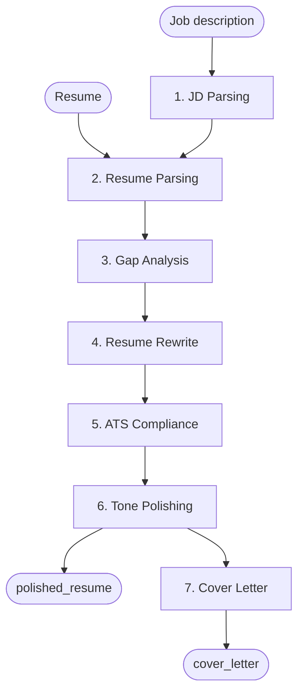
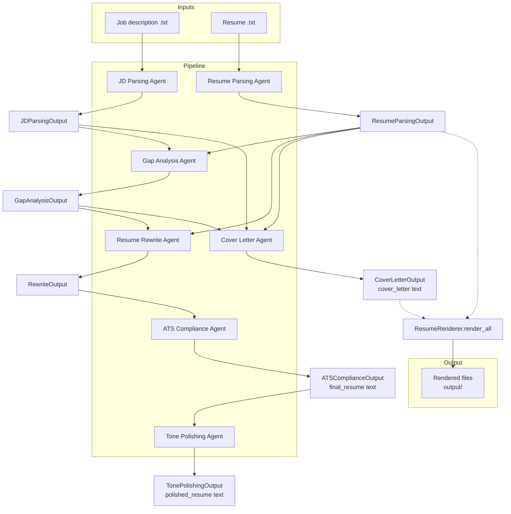

# Architecture

- [Architecture](#architecture)
  - [Overview](#overview)
    - [The 7-agent chain](#the-7-agent-chain)
    - [Two provider backends](#two-provider-backends)
    - [Renderer / formatter layers](#renderer--formatter-layers)
  - [Data Flow](#data-flow)
  - [Agent Chain \& Transition Contracts](#agent-chain--transition-contracts)
    - [Where `ResumeRenderer` hooks in](#where-resumerenderer-hooks-in)
  - [References](#references)
  - [Related](#related)

## Overview

This project is a multi-agent resume optimization pipeline. It takes two plain-text inputs — a job description and a resume — and produces an ATS-optimized resume plus a tailored cover letter, then renders them to multiple file formats.

The runtime follows a strict 7-agent chain. Each agent is a dedicated class in `client/agents/` with its own LLM prompt, Pydantic output model, and deterministic fallback. All seven agents run sequentially on a single event loop, with each agent's validated output fed as the next agent's input.

### The 7-agent chain

| # | Agent | Class | Output model | Fallback |
|---|-------|-------|-------------|----------|
| 1 | JD Parsing | `JDParsingAgent` | `JDParsingOutput` | `FormatDetector` regex + `_extract_company_name` |
| 2 | Resume Parsing | `ResumeParsingAgent` | `ResumeParsingOutput` | `FormatDetector` regex |
| 3 | Gap Analysis | `GapAnalysisAgent` | `GapAnalysisOutput` | Empty result (LLM reasoning required) |
| 4 | Resume Rewrite | `ResumeRewriteAgent` | `RewriteOutput` | `_parsed_to_rewrite` (deterministic tailoring) |
| 5 | ATS Compliance | `ATSComplianceAgent` | `ATSComplianceOutput` | `_default_result` (low-score, resume unchanged) |
| 6 | Tone Polishing | `TonePolishingAgent` | `TonePolishingOutput` | Input resume unchanged |
| 7 | Cover Letter | `CoverLetterAgent` | `CoverLetterOutput` | `_build_fallback_cover_letter` (data-driven template) |

All seven dedicated agents are exported from `client/agents/` and wired by default in `pipeline.py`'s `DEFAULT_AGENT_CLASSES` / `create_runner_from_config()`.

### Two provider backends

Every agent talks to an LLM through the `ModelClient` abstract class (`client/model_client.py`). Two concrete implementations are provided:

- **Ollama** (`client/ollama_client.py`): local, runs against `localhost:11434` via `ollama.AsyncClient`, default model `qwen2.5:7b-instruct`, configurable timeout (default 300s). JSON mode is always on (`format="json"`), optionally replaced by a full JSON Schema for Structured Outputs.
- **OpenAI** (`client/open_ai_client.py`): cloud API, requires `OPENAI_API_KEY`. Uses `response_format="json_object"` in plain JSON mode, or a `{"type": "json_schema", ...}` envelope when a schema is supplied.

Which provider/model each agent uses is decided at runtime by `config/agents.py` reading environment variables (`MODEL_PROVIDER`, `MODEL_NAME`, per-agent `{AGENT}_PROVIDER` / `{AGENT}_MODEL`), and materialized by `ModelClientRegistry.from_config()`. Each `ModelClient.chat()` call carries a provider-native `response_format="json"`, and every agent passes its output model's JSON Schema (from `client/json_utils.model_to_json_schema`) so providers can enforce Structured Outputs.

### Renderer / formatter layers

Structured outputs are turned into user-facing documents by two modules:

- `client/formatter.py` — pure helpers that convert `RewriteOutput` to clean Markdown / plain text (`format_resume_markdown`, `format_resume_plain`) and normalize cover-letter text (`format_cover_letter`, with Unicode→ASCII fixes).
- `client/templates/renderer.py` — `ResumeRenderer`, a Jinja2-based renderer that renders `RewriteOutput` (and `ResumeParsingOutput`-as-`RewriteOutput`) into plaintext, Markdown, DOCX (python-docx) and PDF (ReportLab), plus cover letters in all four formats (plaintext, Markdown, DOCX, PDF). Its `render_all()` writes the `output_files` artifact set and names files via `build_output_path()`.

## Data Flow

The intermediate Pydantic models (`client/models.py`) are the contract between agents: every stage consumes a validated model (or its `model_dump()` serialization) and produces another. The final text artifacts (`final_resume`, `polished_resume`, `cover_letter`) are what downstream consumers and the renderer use.

Entry points that drive this flow:

- `pipeline.py::run_resume_pipeline(runner, jd, resume, ...)` — the synchronous wrapper; it runs the whole chain on a single event loop through `_run_pipeline_core()`.
- `app/main.py` — the FastAPI web layer exposes the same async core (`_run_pipeline_core`) behind `/api/pipeline` (sync) and `/api/pipeline/async` (background task), returning the same 7 result keys plus `output_files`.

## Agent Chain & Transition Contracts

Each stage reads exactly the inputs named below and returns a single validated Pydantic model. The orchestrator (`_run_pipeline_core` in `pipeline.py:432`) runs the chain via `_run_stage` calls and is responsible for serializing models to JSON string before handing them to the next agent.

**1 → 2 — Splitting the raw sources.**

- Input: raw `job_description` and raw `resume` strings.
- These are independent: Agent 1 (`jd_parsing.py`) and Agent 2 (`resume_parsing.py`) run in either order but both precede Agent 3.

**1 → 3 — `JDParsingOutput`.** The JD agent converts raw JD text into `JDParsingOutput` (`role_title`, `company_name`, `seniority_level`, `required_skills`, `preferred_skills`, `responsibilities`, `keywords`, `industry_terms`, `company_signals`). `company_name` is synced into `company_signals["company_name"]` so the name travels with signals.

**2 → 3 — `ResumeParsingOutput`.** Agent 2 converts raw resume text into `ResumeParsingOutput` (`summary`, `skills`, `experience` as `list[ExperienceEntry]`, `projects`, `certifications`, `education`, plus contact fields `name/phone/email/linkedin/github`). Experience is reordered most-recent-first (`_sort_experience`).

**3 — Gap Analysis (`gap_analysis.py`).** Consumes `parsed_job_description` + `parsed_resume`, produces `GapAnalysisOutput` (`missing_skills`, `weak_skills`, `strong_matches`, `recommended_emphasis`, `keyword_strategy`, `bullet_point_improvement_plan`, `tone_guidance`). Skill lists are canonicalized against the shared taxonomy; a deterministic `missing_skills` cross-check is logged against the LLM's output.

**4 — Resume Rewrite (`resume_rewrite.py`).** Consumes `parsed_resume` + `tailoring_strategy`, produces `RewriteOutput` (the structured resume: `summary`, `skills`, `experience`, `projects`, `certifications`, `education`). Post-validation enforces: no fabricated new experience, no fabricated companies, all input certifications preserved, skills traceable to the input, and chronological order (fixed, not rejected).

**5 — ATS Compliance (`ats_compliance.py`).** Consumes `rewritten_resume`, produces `ATSComplianceOutput` (`ats_score` 0-100, `missing_keywords`, `formatting_issues`, `clarity_issues`, `recommended_fixes`, `auto_fixes_applied`, `final_resume` = the full corrected resume text). Scores are clamped, and an empty `final_resume` is backfilled from the input.

**6 — Tone Polishing (`tone_polishing.py`).** Consumes `ats_optimized_resume` (the `final_resume` string), produces `TonePolishingOutput` (`polished_resume`). Factual content must not change.

**7 — Cover Letter (`cover_letter.py`).** Consumes `parsed_job_description` + `parsed_resume` + `tailoring_strategy`, produces `CoverLetterOutput` (`cover_letter`). Deterministic post-processing enforces the target company name (`_apply_company_name`), the candidate name (`_apply_candidate_name`), and appends the candidate's contact line when missing.

### Where `ResumeRenderer` hooks in

After stage 7, `_run_pipeline_core` optionally renders files. When `candidate_name` is non-empty:

1. The structured resume data is rebuilt from the **parsed resume** (converted to `RewriteOutput` via `_to_rewrite_output`), *not* from the rewritten/polished text — the structured model preserves bullet/list structure for the Jinja2 templates.
2. `CoverLetterOutput(cover_letter=...)` carries the stage-7 letter text.
3. `ResumeRenderer.render_all(...)` writes up to 8 formats into `output/`: `resume_plaintext`, `resume_markdown`, `resume_docx`, `resume_pdf`, and (when letter text is non-empty) `cover_letter_plaintext`, `cover_letter_markdown`, `cover_letter_docx`, `cover_letter_pdf`. A single layout is rendered by default (`resume_template`); passing `resume_templates` renders each requested layout under namespaced keys (`resume_{template}_*`) with the template embedded in the filename so the layouts don't overwrite each other. The cover letter formats are shared and unaffected.

When no candidate name is available (explicit `candidate_name` or the name
parsed from the resume), rendering is skipped and `output_files` is `{}`.

## References

- `client/models.py` — all intermediate Pydantic models (`JDParsingOutput`, `ResumeParsingOutput`, `ExperienceEntry`, `GapAnalysisOutput`, `RewriteOutput`, `ATSComplianceOutput`, `TonePolishingOutput`, `CoverLetterOutput`) and the regex models (`ParsedResume`, `ParsedJobDescription`). See also `docs/models.md`.
- `client/formatter.py` — Markdown/plain/cover-letter formatting helpers.
- `client/templates/` — Jinja2 resume templates (`modern`/`classic`/`minimal`) + cover letter template.
- `client/templates/renderer.py` — `ResumeRenderer` (`render_all`, `render_plaintext`/`render_markdown`, `render_cover_letter_*`, `render_docx`, `render_pdf`, `build_output_path`).
- `client/model_client.py`, `client/model_registry.py`, `client/ollama_client.py`, `client/open_ai_client.py` — provider backends and per-agent registry.
- `config/agents.py` — environment-driven agent-to-model selection.
- `client/agents/` — the dedicated agent classes (`jd_parsing.py`, `resume_parsing.py`, `gap_analysis.py`, `resume_rewrite.py`, `ats_compliance.py`, `tone_polishing.py`, `cover_letter.py`).
- `pipeline.py` — `AgentRunner`, `run_resume_pipeline`, `_run_pipeline_core`, `create_runner_from_config`, `DEFAULT_AGENT_CLASSES`, sample run.
- `docs/logging-info.md` logging setup; `scratch/resume-done.md` completed work; `scratch/bots.md` pipeline description.
- `app/main.py` — FastAPI web layer exposing the same core pipeline.

---

## Related

- [Previous: `api.md`](api.md)
- [Next: `logging-info.md`](logging-info.md)
- [Index: `docs/README.md`](README.md)
